 

 

---

### 👋 About

Data Scientist / ML Engineer based in **London** with **6+ years** across engineering and analytics, now focused on **machine learning, NLP/GenAI, and automation**. I build predictive models, retrieval-augmented (RAG) LLM applications, and data pipelines that deliver measurable, interpretable results — models teams can actually trust and act on. Recently completed an **MSc in Data Science** (Middlesex University, London).

- 🔬 Interested in **data-centric AI**, LLM/RAG systems, and putting ML into production
- 🌱 Currently deepening **MLOps** and applied **GenAI** work
- 💬 Ask me about **label noise, retrieval evaluation, or model interpretability**
- 📫 Reach me via **[portfolio](https://karannishchal.netlify.app)** · **[LinkedIn](https://www.linkedin.com/in/karannishchal/)** · **karannishchal@gmail.com**

---

### 🚀 Featured Projects

| Project | What it is | Stack |
|---|---|---|
| **[Data-Centric AI: Label Accuracy vs. Model Architecture](https://github.com/karannishchal/label-accuracy-vs-model-architecture)**   ⭐ [**Live app →**](https://label-accuracy-vs-model-architecture-f2fwsopq2p3vuak7pk6xdc.streamlit.app/) | MSc dissertation — a full-factorial study showing cleaner labels beat fancier models for diabetes classification, with an interactive Streamlit explorer. | `scikit-learn` `XGBoost` `TensorFlow/Keras` `Streamlit` |
| **[AskMyDocs](https://github.com/karannishchal/askmydocs)** | A RAG search system: BM25 + dense (FAISS) + hybrid (RRF) retrieval, offline Recall@k / MRR evaluation, and grounded, cited answers. | `Python` `FAISS` `sentence-transformers` `BM25` |
| **[Bank Customer Churn Prediction](https://github.com/karannishchal/bank-customer-churn-prediction)** | End-to-end ML pipeline with model comparison, ROC-AUC evaluation, and threshold optimization. | `Python` `scikit-learn` `Jupyter` |

---

### 🛠️ Tech Stack

 

---

### 🐍 Contribution Activity

---

🎯 Open to Data Scientist & ML Engineer roles · London / Remote

